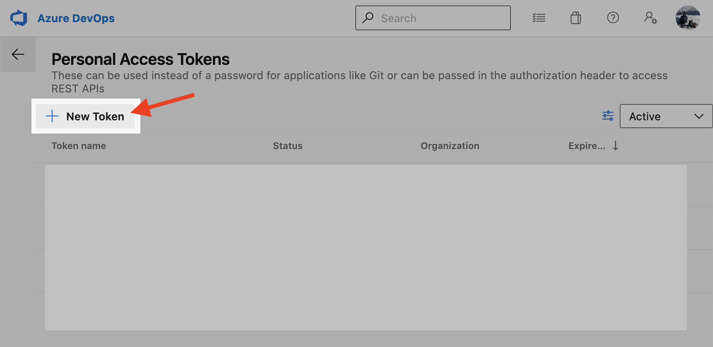
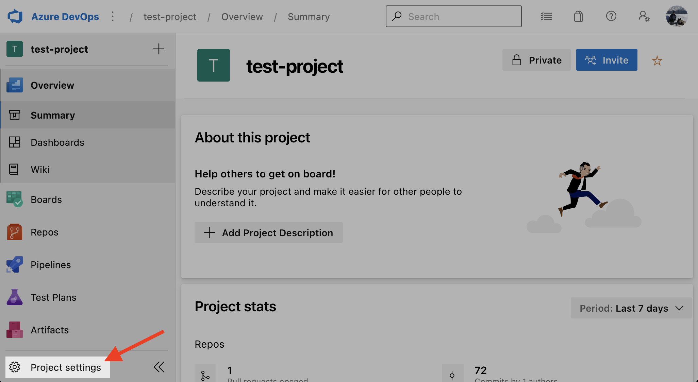
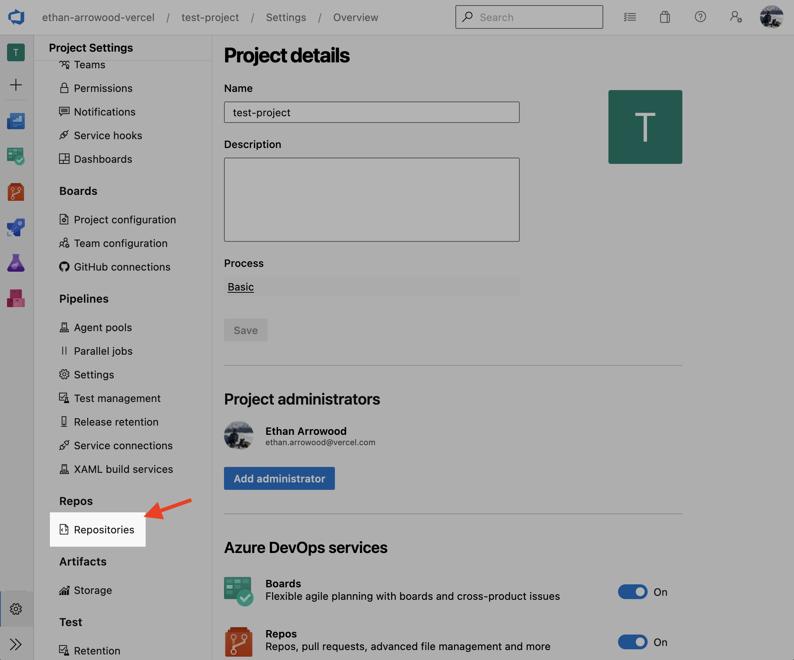
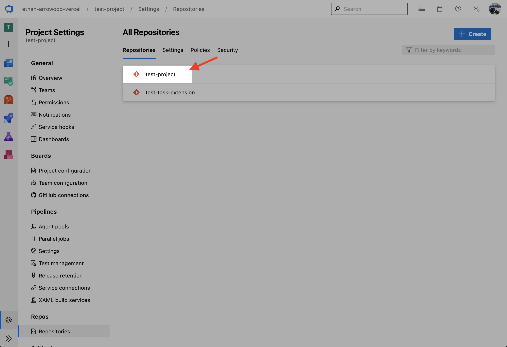
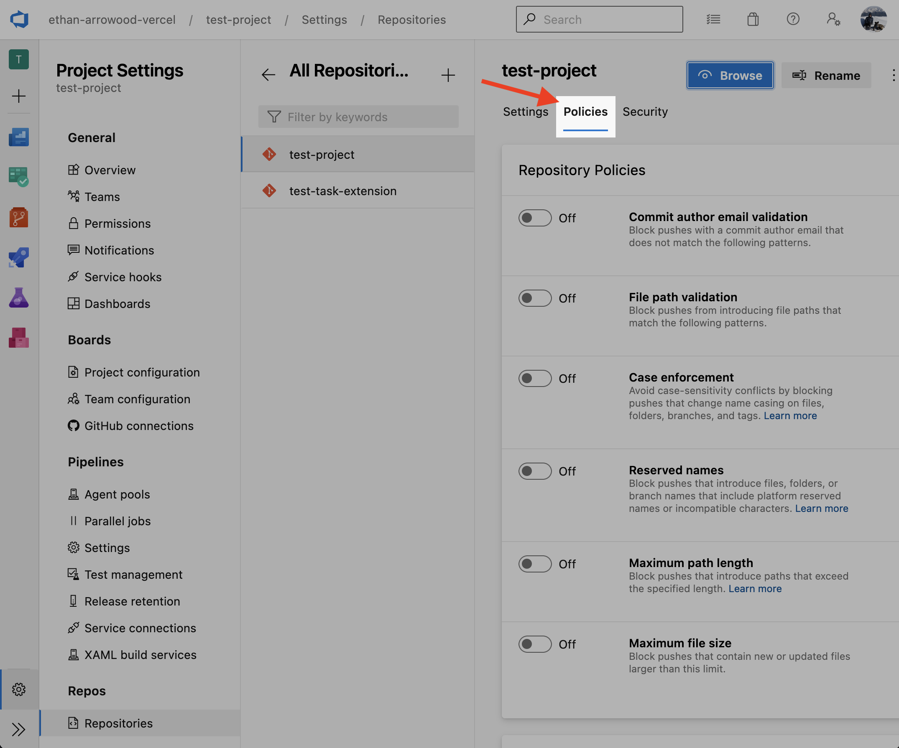
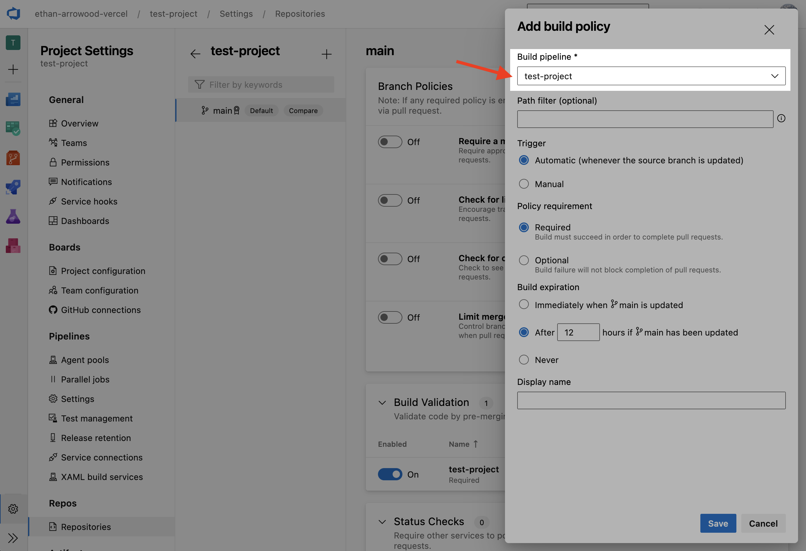
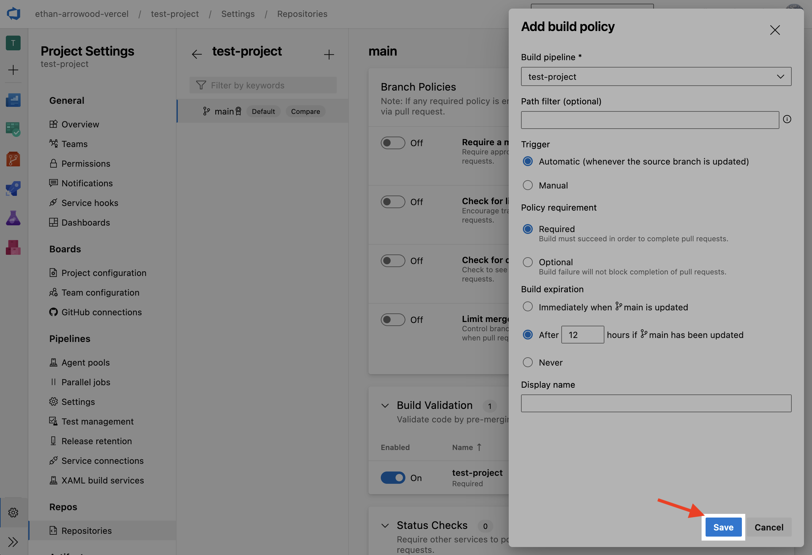

# Vercel Azure DevOps Extension

This extension contains the [Vercel Deployment Task] for automatically deploying your Azure DevOps project to Vercel. It contains other useful features like automatic Pull Request comments and a template pipeline for quick set up.

- [Vercel Azure DevOps Extension](#vercel-azure-devops-extension)
  - [Extension Set Up](#extension-set-up)
  - [Basic Pipeline Set Up](#basic-pipeline-set-up)
  - [Full Featured Pipeline Set Up](#full-featured-pipeline-set-up)
  - [Extension Reference](#extension-reference)
    - [Task: `vercel-deployment-task`](#task-vercel-deployment-task)
      - [Properties](#properties)
  - [Azure PAT Set Up](#azure-pat-set-up)
  - [Azure Build Policy Set Up](#azure-build-policy-set-up)

## Extension Set Up

1. Create a Vercel Project
1. Create a Vercel Personal Access Token with permissions to deploy the project created on step 1 (see the [Vercel PAT Set Up](https://vercel.com/guides/how-do-i-use-a-vercel-api-access-token) guide for more information)
1. Create a Azure DevOps Personal Access Token with permissions to Read/Write Pull Request threads (see the [Azure PAT set up](#azure-pat-set-up) guide for more information)
1. Store these tokens as secret variables in your preferred methodology. Azure recommends using the [UI, Variables Groups, or Azure Key Vault](https://learn.microsoft.com/en-us/azure/devops/pipelines/process/set-secret-variables). Whichever methodology you use, make sure it is accessible from Azure Pipelines.
1. Navigate to the [Vercel Deployment Extension](https://marketplace.visualstudio.com/items?itemName=Vercel.vercel-deployment-extension) Visual Studio Marketplace page and add the extension to your organization.
   > Note: This step will not work until the extension is shared with the user or we make the extension public.
1. With the extension added, you are now ready to use it in your Azure Pipeline. It is referable using `- task: vercel-deployment-task@0`.
   > Note: The `@0` represents the Major version of the task that the pipeline should use. During prerelease, we will publish the extension under Major version `0`. The extension will use Major version `1` when it is released publicly.

Explore the following pipeline guides for further set up instructions:

- [Basic Pipeline Set Up](#basic-pipeline-set-up)
- [Full Featured Pipeline Set Up](#full-featured-pipeline-set-up)

## Basic Pipeline Set Up

This short guide will demonstrate how the extension can be used to automatically deploy the `main` branch to production. Make sure the steps in [Extension Set Up](#extension-set-up) have been completed.

1. Start by creating a new pipeline file in your repo called `basic-pipeline.yml`. Either use the in-browser editor, or in your local file editor.
1. Add a `trigger:`, `pool:`, and `steps:` declarations:

   ```yaml
   trigger:
     - main

   pool:
     vmImage: ubuntu-latest

   steps:
   # - task: ...
   ```

   > The `trigger:` declaration states that this pipeline should run for all commits to the `main` branch.

1. Now add the extension's task `vercel-deployment-task`:
   ```yaml
   steps:
     - task: vercel-deployment-task@0
       inputs:
         vercelProject: "<project-name>"
         vercelToken: "<vercel-token>" # '$(VERCEL_TOKEN)'
         production: true
         azureToken: "<azure-token>" # '$(AZURE_TOKEN)'
   ```
   > Note: The `@0` represents the Major version of the task that the pipeline should use. During prerelease, we will publish the extension under Major version `0`. The extension will use Major version `1` when it is released publicly.
   - The `vercelToken` and `azureToken` should reference the secret variables defined in [Extension Set Up](#extension-set-up).
1. Commit, and push the pipeline to the repository.
1. Navigate to Azure Pipelines and run the task for the first time if it doesn't run automatically.
1. Make a change to your project and commit to the `main` branch, a new deployment pipeline run should automatically kick off in Azure Pipelines, and the Vercel Project should automatically update.

## Full Featured Pipeline Set Up

This guide will demonstrate how to improve the [Basic Pipeline Set Up](#basic-pipeline-set-up) pipeline in order to deploy from `main` to production _and_ deploy from pull requests to preview.

1. Starting with the pipeline file created in [Basic Pipeline Set Up](#basic-pipeline-set-up), duplicate, rename, or open it in your editor of choice.
2. Add a variable above the `steps` block
   ```yaml
   variables:
     isMain: $[eq(variables['Build.SourceBranch'], 'refs/heads/main')]
   ```
3. Update the `production: true` input to be `production: $(isMain)`
4. Below `inputs:`, add a `condition`:
   ```yaml
   inputs:
     # ...
   condition: or(eq(variables.isMain, true), eq(variables['Build.Reason'], 'PullRequest'))
   ```
5. Push these changes to the repository, and set a [Build Policy](#azure-build-policy-set-up) for the `main` branch.

## Extension Reference

### Task: `vercel-deployment-task`

#### Properties

- `vercelProject`

  The name of your Vercel Project

  Type: `string`

  Required: `true`

- `vercelToken`

  A Vercel personal access token with deploy permissions for your Vercel Project. [Guide](https://vercel.com/guides/how-do-i-use-a-vercel-api-access-token)

  Type: `string`

  Required: `true`

- `production`

  Should the task deploy to production? When omitted, or set to `false`, the task will create _preview_ deployments.

  Type: `boolean`

  Default: `false`

  Required: `false`

- `azureToken`

  An Azure personal access token with the Git 'PullRequestContribute' permission for your Azure DevOps Organization. [Guide](https://learn.microsoft.com/en-us/azure/devops/organizations/accounts/use-personal-access-tokens-to-authenticate)

  Type: `string`

  Required: `true`

## Azure PAT Set Up

### 1. Go to [https://dev.azure.com](https://dev.azure.com) and click on the settings icon in the top right.


### 2. Click on the _Personal access tokens_ menu option


### 3. Click on _New Token_



### 4. After filling in the basic token information like name, organization, and expiration, click on _Custom Defined_ under Scopes


### 5. Then, _Show all scopes_ button at the bottom of the prompt


### 6. Then, within the scopes list, scroll until _Pull Request Threads_, and select the _Read & Write_ toggle.


### 7. Click _Create_, and don't forget to copy the token as once you exit the prompt it will not be retrievable.


## Azure Build Policy Set Up

### 1. Navigate to the Azure DevOps organization Overview page. Click on **Project Settings** in the lower left corner.



### 2. In the **Project Settings** list on the left, scroll down and click on the `Repositories` option



### 3. Select the repository



### 4. On the right side, select **Policies**



### 5. Scroll down to **Branch Policies**, and select the `main` branch


### 6. Scroll down to **Build Validation**, and click on the `+` button to create a new validation policy.


### 7. Select the pipeline previously created



> Keep the policy marked as **Required** so that commits directly to `main` are prevented.

### 8. Finally, save the new validation policy



### 9. Create a pull request to the `main` branch, and if everything is set up correctly, the pipeline will run and comment back on the PR the deployment URL 🎉
